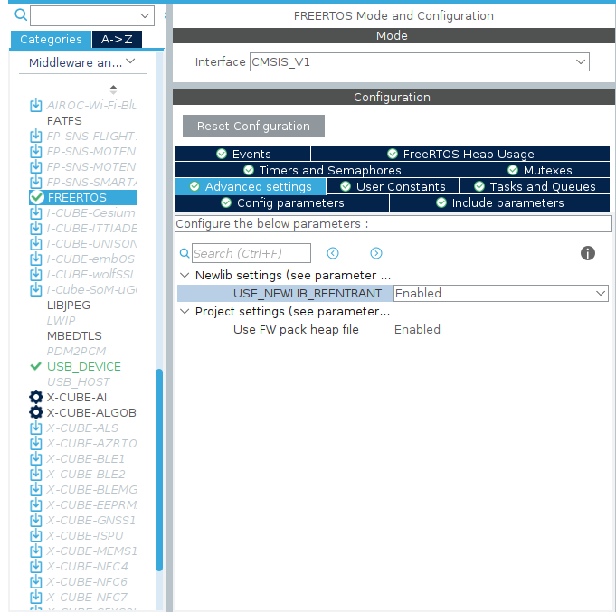

# Micro-XRCE-DDS-Client MCU porting demo

## Compile and Flash

```bash
git clone https://github.com/Pansamic/Micro-XRCE-DDS-Client-MCU
git submodule init
git submodule update
mkdir build && cd build
cmake ..
make -j
openocd -f interface/stlink.cfg -f target/stm32f4x.cfg -c "program ./Micro-XRCE-DDS-Client-MCU.elf verify reset exit"
```

It need to automatically git clone from github. If you failed to compile because of failing to git clone, please check your web connection.

## Function of This Demo

1. send customized `HelloWorld` message periodically.
2. use USB CDC(default) or USART1 as transport interface.

## Use other MCUs

It's impossible to port this to device whose flash size less than 256KB, especially the most common one - STM32F103C8T6 core board.

1. **Create another STM32CubeMX code project**
    1.1 Configure Clock configuration, notice that RTC clock source is HSE, choose proper division number to make RTC clock under 1000kHz.
    
    1.2 RTC configure
    Make sure RTC clock source(as seen in the picture above is 1000kHz)/(Asynchronous Predivider+1 + Synchronous Predivider+1)=1Hz
    
    1.3 USART configuration
    Async mode
    1.4 USB FS configuration
    
    1.5 USB Device CDC configuration
    
    1.6 FreeRTOS configuration
    
    
    

2. **copy the following files to your project**
    ```
    Core/Inc/HelloWorld.h
    Core/Src/HelloWorld.c
    Core/Inc/uxr_transport.h
    Core/Src/uxr_transport_uart_it.c
    Core/Src/uxr_transport_usb.c
    toolchains/gcc-arm-none-eabi.cmake
    CMakeLists.txt
    ```
3. **copy essential functions**
    copy `clock_gettime()` and `__write()` functions in `Core/Src/main.c` to your new `main.c`
    copy init code of Micro-XRCE-DDS-Client in `Core/Src/freertos.c` to your new `freertos.c`

4. **include essetial headers**
    just copy included headers in `Core/Src/main.c` and `Core/Src/freertos.c`. Here are some core headers.
    ```c
    #include <time.h>
    #include <errno.h>
    #include <stdio.h>
    ```

## Micro-XRCE-DDS-Client Porting Details

### Add Client CMake Project

```cmake

include(ExternalProject)

# Set the URL of the Git repository
set(UXRCE_URL "https://github.com/eProsima/Micro-XRCE-DDS-Client.git")

# Set the destination directory for the cloned repository
set(EXTERNAL_REPO_DIR "${CMAKE_BINARY_DIR}/external")

# Set CMake configuration parameters
set(UXRCE_CMAKE_ARGS
    -DCMAKE_BUILD_TYPE=Debug
	-DCMAKE_C_FLAGS=${CMAKE_C_FLAGS}
    -DCMAKE_INSTALL_PREFIX=${CMAKE_BINARY_DIR}/install
	-DCMAKE_TOOLCHAIN_FILE=${CMAKE_TOOLCHAIN_FILE}
	-DUCLIENT_PIC=OFF
	-DUCLIENT_PROFILE_DISCOVERY=OFF
	-DUCLIENT_PROFILE_UDP=OFF
	-DUCLIENT_PROFILE_TCP=OFF
	-DUCLIENT_PROFILE_SERIAL=OFF
    # Add more configuration parameters as needed
)

# Use ExternalProject_Add to clone the repository and configure the project
ExternalProject_Add(
    micro-xrce-dds-client
    PREFIX ${EXTERNAL_REPO_DIR}
    GIT_REPOSITORY ${UXRCE_URL}
    TIMEOUT 1000
    CMAKE_ARGS ${UXRCE_CMAKE_ARGS}
)

# Specify the target to depend on the external project
add_dependencies(${PROJECT_NAME} micro-xrce-dds-client)

target_link_libraries(${PROJECT_NAME}
	${CMAKE_BINARY_DIR}/install/lib/libmicroxrcedds_client.a
	${CMAKE_BINARY_DIR}/install/lib/libmicrocdr.a)
target_include_directories(${PROJECT_NAME} PUBLIC
	${CMAKE_BINARY_DIR}/install/include
)
```